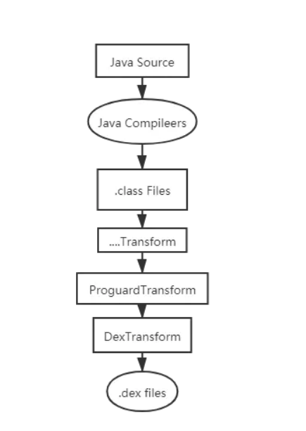

# DetectionPlugin
## 简介
DetectionPlugin是一款帮助开发者检测权限、隐私API使用，完成隐私合规的gradle 插件。
## 功能
* 编译过程中的静态字节码扫描
* 编译后的APK逆向检测
* 基于字节码插桩的动态运行检测
## 技术方案
具体来说，检测可以分为两类场景，在开发过程中的源码检测和打包后的产物检测。
对于源码检测，可以设置在在编译过程中，对中间产物class进行检测。这里可以使用transfom来实现，transform检测工作流程如下图所示：

自定义transform后，使用asm操作字节码：1、读取class，检测非权限敏感API。2、代码插桩、在API调用前，记录权限api调用栈。
产物检测相对来说：拓展性更强一些，可以批量检测多个应用，且用户只需要上传编译后的APK即可。这里采用了soot框架，检测的流程如下图所示：

## 使用方式
### 源码检测
项目中包含了一个app示例代码，在编译app的过程中，会自动完成隐私API的检测和插桩。
### [产物检测](https://github.com/mooncakedevop/staticAnalysis)
运行前请指定，要分析的apk和Android sdk的Platforms路径，然后运行PrivacyDetection的main方法即可，详细说明见产物检测仓库。